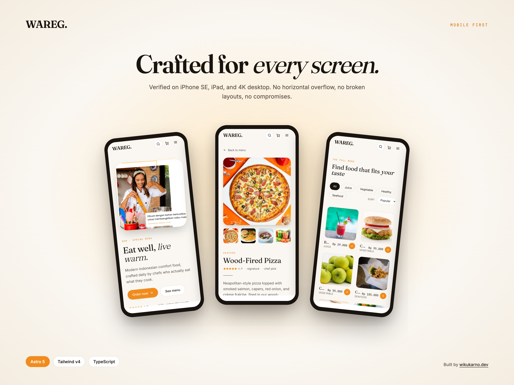

# Wareg Restaurant



A modern restaurant landing site built with Astro 5, Tailwind v4, and TypeScript. Frontend-only portfolio piece — no backend, mock cart and auth via `nanostores` + `localStorage`.

## Features

- **5 routes** — home, menu list (with filter + sort), dish detail, cart, login, register
- **Mock cart** — add / remove / change quantity, persists across reloads, checkout flow with order confirmation
- **Mock auth** — register and sign in against a `localStorage`-backed user list (demo user seeded on first load)
- **Favorites** — toggle per dish, persists across reloads
- **Content-driven** — 40 dishes, 8 chefs, 4 reviews are JSON files validated by Zod schemas at build time
- **Responsive** — verified from 375px (iPhone SE) up to 1920px without horizontal overflow
- **Accessible** — keyboard navigable, ARIA tabs, focus rings, skip-to-content, reduced-motion respected
- **SEO ready** — sitemap, JSON-LD `Restaurant` + `MenuItem` schema, OpenGraph meta

## Stack

- [Astro 5](https://astro.build) — static site generation, content collections
- [Tailwind CSS v4](https://tailwindcss.com) — CSS-first design tokens via `@theme`
- [nanostores](https://github.com/nanostores/nanostores) — tiny shared state for cart + auth + UI flags
- [Zod](https://zod.dev) via Astro Content Collections — typed menu / chef / review data
- TypeScript, Vitest

## Requirements

Node 18.17.1+ / 20.3.0+ / 22+ (any version supported by Astro 5).

## Getting started

```bash
git clone https://github.com/wikukarno/wareg_restaurant.git
cd wareg_restaurant
npm install
npm run dev
```

Open http://localhost:4321/

## Commands

| Command | What |
|---|---|
| `npm install` | Install dependencies |
| `npm run dev` | Dev server at http://localhost:4321 |
| `npm run build` | Production build to `./dist/` |
| `npm run preview` | Preview the production build locally |
| `npm test` | Run unit tests (cart, auth, format, data helpers) |
| `npm run test:watch` | Watch mode |

## Project structure

```
src/
├── content/              40 menu + 8 chefs + 4 reviews (JSON, Zod-typed)
├── components/
│   ├── ui/               atomic UI (Button, Card, Input, Rating, …)
│   ├── sections/         page sections (Hero, SpecialsGrid, CategoryTabs, …)
│   ├── nav/              Navbar, MobileMenu, CartIcon
│   ├── cart/             CartDrawer
│   ├── motion/           FadeIn
│   └── icons/            inline SVG icon set
├── layouts/              BaseLayout, AuthLayout
├── lib/                  cart, auth, format, data, ui-state stores + helpers
├── pages/                index, menu/[slug], cart, login, register
└── styles/               global.css with Tailwind v4 @theme tokens

public/images/            static images served as-is
tests/lib/                Vitest unit tests for lib/*
```

## Routes

- `/` — Hero, specials, category tabs, chef carousel, reviews, newsletter
- `/menu` — All dishes with category filter and price sorting (URL-driven state)
- `/menu/[slug]` — Dish detail with gallery, quantity stepper, add-to-cart, favorite toggle, related dishes
- `/cart` — Editable cart with order summary and checkout
- `/cart/done` — Mock order confirmation with order ID and ETA
- `/login` / `/register` — Split-layout auth pages with client-side validation

## Demo credentials

Email: `demo@wareg.id`
Password: `demo1234`

## Deployment

The build output in `./dist/` is fully static and can be deployed to any static host (Vercel, Netlify, Cloudflare Pages, GitHub Pages, etc.). No environment variables required.

---

Built by [wikukarno.dev](https://wikukarno.dev) as a portfolio piece.
